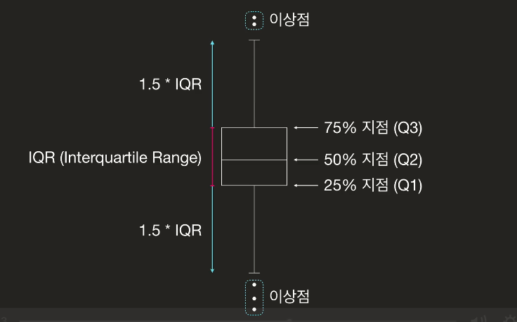

## 이상점 판단

- 이상점이 잘못된 데이터일 경우
    - 고치거나 제거
- 이상점이 제대로된 데이터일 경우
    - 이상점이 분석에 방해가 되면 제거
    - 의미있는 정보라면 그냥 둔다
- 이상점 제거 : cleaning.ipynb 의 정확성2 파트 참고

## 관계적 이상점(Relational Outlier)
- 두 변수의 관계를 고려했을 때 이상한 데이터
- cleaning.ipynb 의 정확성 3 파트 참고
