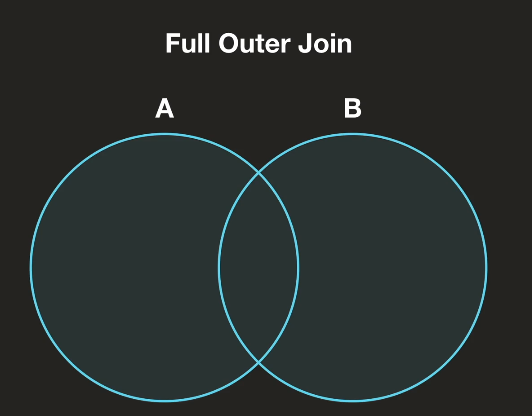

## 새로운 값 계산하기
- 주어진 데이터에서 Slicing 과 Indexing 활용하여 가설을 세우고 검증하여 인사이트를 도출할 수 있다.
- 각종 그래프 활용

## 문자열 필터링
```python
# Blues 포함된 String 검색
df[df['Genre'].str.contains('Blues')] 
# Blues 로 시작하는 String 검색
df[df['Genre'].str.startswith('Blues')] 

```
## 문자열 분리

```python
address=df['소재지도로명주소'].str.split(n=1,expand=True)
df['관할구역']=address[0]
```

## CategorizeV
```python
brand_nation={
    'Dell':'U.S',
    'Apple':'U.S',
    'Acer':'Taiwan',
    'HP':'U.S',
    'Lenovo':'China',
    'Alienware':'U.S',
    'Microsoft':'U.S',
    'Asus':'Taiwan'
}
df['brand'].map(brand_nation) # 해당 대응되는 value로 mapping 됨
```

## 데이터 합치기(Merge)
- inner join
    - 겹치는 부분에 대해서만 합쳐줌


- left outer join
    - 왼쪽 데이터와 겹치는 부분 합쳐줌


- right outer join
    - 오른쪽 데이터와 겹치는 부분 합쳐줌


- full outer join
    - 모든 영역을 합쳐줌


> 자세한 설명은 코드 참고(add_data.ipynb)
