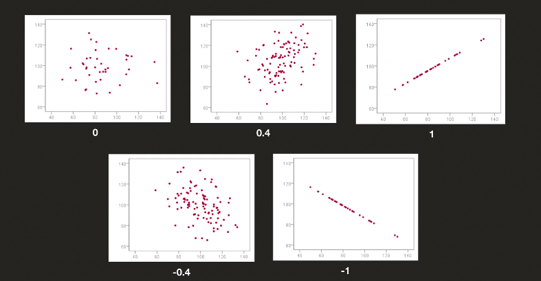

## 평균
- 전체 데이터 셋의 합 / 데이터 셋의 갯수
- 이상한 데이터가 있을 경우 값이 튈수가 있음

## 중간값
- 정렬했을 때 중간에 있는 값
- 데이터의 갯수가 짝수일 경우에는 중간의 두 값의 평균
- 잘못 됐거나 특이한 값이 있을 떄 유용함

## 상관계수(Correlation Coefficient)
- Pearson CC

    - 1에 가까울 수록 상관관계
    - 0이면 상관관계 없음
    - -1이면 반대되는 상관관계