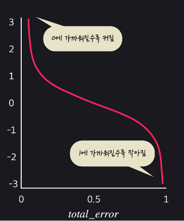
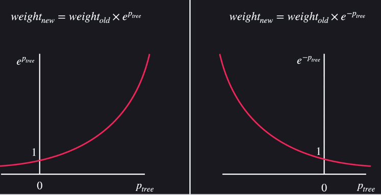

# 애다부스트(Adaboost)

## Boosting

- 앙상블 기법
- 일부러 성능이 안 좋은 모델을 사용
- 먼저 만든 모델의 성능이 뒤에 모델의 데이터 셋을 바꾼다
- weaklearners(성능 안 좋은 모델) 를 합쳐서 성능을 극대화

## 개요

- 성능이 좋지 않은 결정 stump를 많이 만들어 줌
- 뒤의 stump는 전의 stump들이 틀린 데이터를 더 중요하게 맞춘다
- 예측을 종합할 때 성능이 좋은 stump의 의견 비중을 더 높게 반영한다

## 스텀프 성능 개선하기

- 스텀프의 성능 : 
  - total_error : 틀리게 예측한 데이터 중요도의 합
  - 
  - 성능을 잘 맞출수록, 잘 못맞출수록 기하급수적으로 늘리고 줄여준다

## 데이터의 중요도 바꾸기

- 틀리게 예측한 데이터 중요도 : 
  - Ptree : stump의 성능
- 제대로 예측한 데이터의 중요도 : 
- 
- 바꾸고 나서 중요도의 합이 1이 되게끔 조정해 주어야 함(모든 중요도의 합으로 나누기)

## 스텀프 추가하기

- 임의의 숫자를 골라서 중요도에 따라 새로운 데이터 셋을 만듦
  - 중요도가 높을수록 뽑힐 확률이 높아짐
  - 따라서 뒷 스텀프는 틀린 문제를 더 중요하게 학습하게 됨

## 예측하기

- 스텀프 성능의 합을 더해서 더 높은 쪽으로 예측

## sklearn Adaboost

- sklearn.ipynb 참고