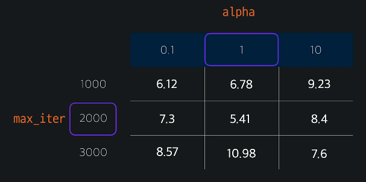

# 모델 평가와 하이퍼파라미터 고르기

## k겹 교차 검증

- 전체 데이터를 k개의 같은 사이즈로 나눔
- 각 나누어진 데이터를 test_date로 활용하면서, k개의 성능을 추출
  - 평균성능을 계산

## sklearn k겹 교차 검증

- sklearn.ipynb 참고

## 그리드 서치

- 하이퍼 파라미터 : 학습을 하기 전에 미리 정해줘야 하는 파라미터
  - alpha, max_iter... 등
- Grid Search
  - 파라미터에 후보값들을 선정하여 어떤 값을 넣었을 때 최대의 효과를 내는지 판단
  - 
