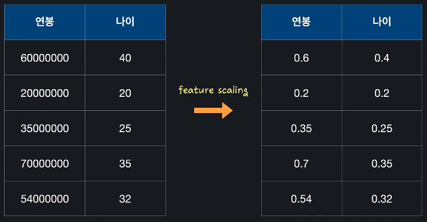
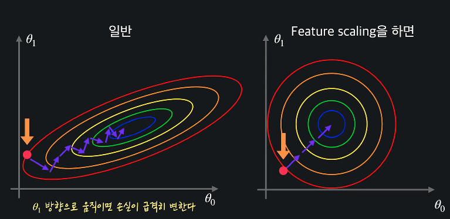
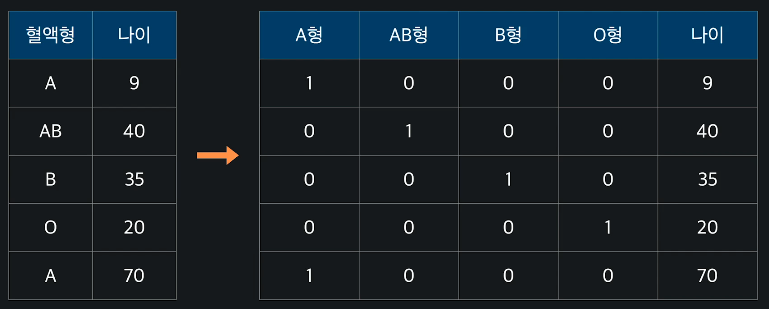

# 데이터 전처리

- 데이터를 그대로 사용하지 않고 가공하여 모델을 학습시키는 데 좋은 형식으로 만들어 줌

## Feature Scaling

- 입력 변수의 크기 조정해서 일정 범위 내에 떨어지도록 함
- 
- 경사하강법을 좀 더 빨리할 수 있게 도와줌

### min-max normalization

- 0 ~ 1사이값으로 만드는 것
- 

### sklearn - feature scaling

- sklearn.ipynb 참고

## 경사하강법

- feature scaling 을 통해서 경사하강법을 빨리 할 수 있게 해준다
- 
- 다항회귀나 로지스틱 회귀에서도 feature scaling을 통해 성능을 높일 수 있다

## 표준화(normalization)

- 
  - x-bar = 평균 / 시그마 = 표준편차
- sklearn활용 : sklearn.ipynb참고

## One-hot Encoding

- 범주형 데이터 --> 수치형 데이터로 바꾸어 주어야 함
  - A형 : 0 / AB형 1 ... 등
  - 하지만, 이렇게 하면 범주 사이에 크고 작음이 생겨버림
- 보통 One-hot Encoding 사용해서 범주형 -> 수치형 데이터로 만들어 줌
- 
- pandas사용 -> one_hot_encoding.ipynb 참고

