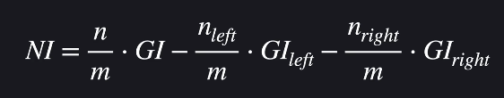

# 결정트리

- 예/아니오 질문들 --> 질문에 답을 해 나가면서 데이터를 분류
  - ex) 교통사고의 사망률
    - 안전벨트를 했나요?
    - 시속 100kn/h가 넘었나요? 등...
  - 질문 하나하나를 노드(제일 첫 질문을 root노드, 마지막을 leaf노드)
- 데이터 분류하는 방법이 직관적
- 쉽게 해석할 수 있다

## 지니 불순도(Gini Impurity)

- 데이터 셋 안에 서로 다른 분류들이 얼만큼 섞여있는지
- 작을수록 데이터 셋이 순수, 클수록 불순
  - ex) 독감 환자 데이터 셋에서..
  - 

## 분류 노드 평가하기

- 데이터셋의 불순도를 계산하면 어느정도의 데이터를 맞출 수 있는지 예상할 수 있음

## 질문 노드 평가하기

- 질문으로 나뉜 데이터셋이 순수할수록(지니 불순도가 낮을수록) 질문의 성능이 좋다

## 노드 고르기

- 불순도가 가장 낮은 노드를 고르면 됨

## 모든 노드 만들기

- 불순도가 가장 낮은 질문을 고르고 깊이를 제한해준다던지 조건을 만들고 트리를 생성

## 속성 중요도(Feature Importance)

- 
  - n : 노드까지 오는 데이터 수
  - m : 전체 학습 데이터 수
- 위 노드에서 아래 노드로 내려가면서 불순도가 얼마나 줄어들었는지를 계산하는 것
- 해당 속성의 중요도 = 질문 중요도 합 / 모든 노드 중요도 합

## sklearn 이용해서 결정트리 구현

- sklearn.ipynb 참고