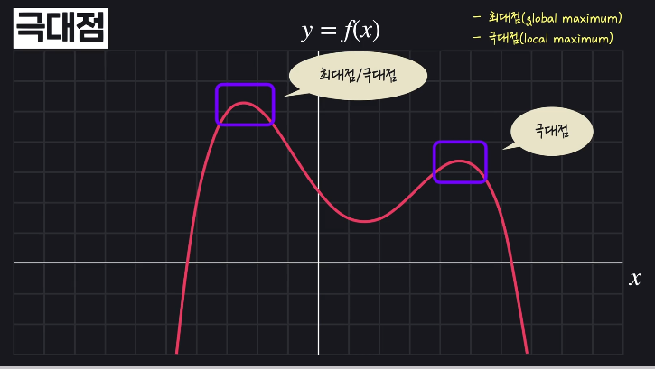

## 함수
- 
- 하나의 인풋에 대해서 하나의 아웃풋!

## 그래프
- 수학식을 시각적으로 표현

## 평균 변화율
- 

## 순간 변화율
- 
- 

## 미분
- 

## 극소점, 극대점
- 
- 
- 

## 고차원 미분
   
   
 
> 

## 고차원에서 가장 가파른 방향
- 기울기가 벡터(미분 방정식) : 가장 가파르게 올라가는 방향
    - 음수는 가장 가파르게 내려가는 방향
