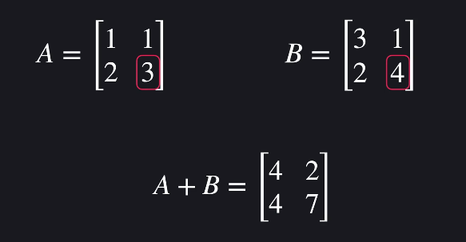
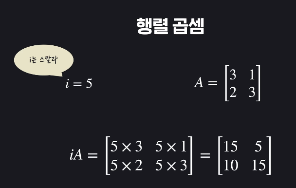
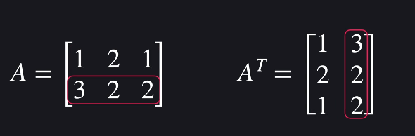
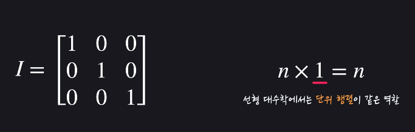
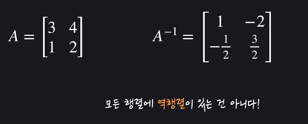
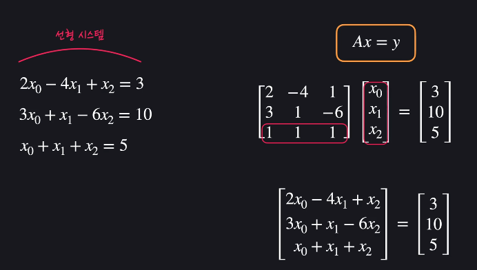

## 일차식과 일차함수
- 선형대수학 : 일차식, 일차함수를 공부하는 학문

## 일차함수 표기법
- 예시 :   
   

## 행렬과 벡터
- 행렬(Matrix) :    
3행 4열 형태(3X4)   
   
   
Aij = i행j열
- Vector:
    - 1행 또는 1열 Matrix
    - 보통 열벡터를 의미함

## numpy로 행렬 사용하기
- numpy_matrix.ipynb 참고

## 행렬연산
- 덧셈은 각 해당 위치끼리 더해줌(차원 같아야함)   

- 행렬곱셈
    - 스칼라 곱셈   
    
    - 내적곱(n*m X m*o = n*o)
        - 가운데 차원이 같아야함. 방법은 고등수학 1 참고
- 요소별 곱하기
    - A∘B(각 요소끼리 곱해줌)
    - np.array * np.array # 해주면 요소별 곱셈

## numpy 행렬 연산
- numpy_matrix.ipynb 참고

## 전치행렬, 단위행렬, 역행렬
- 전치행렬   

- 단위행렬

- 역행렬

## numpy롤 전치,단위, 역행렬 사용
- numpy_matrix.ipynb 참고

## 선형대수학과 행렬/벡터
- 
- 아무리 복잡하더라도 Ax = y 형태로 표현 가능