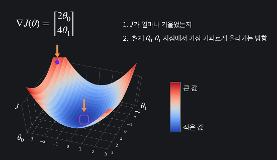
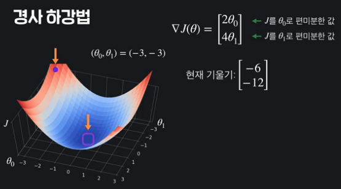
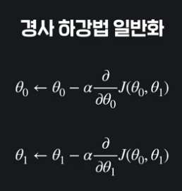
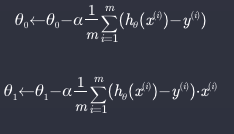

## 선형회귀
- 집가격 예측 모델   

- 가장 데이터셋을 잘 표현하는 직선을 찾는 것

## 선형회귀 용어
- 지도학습이라고 할 수 있음 (회귀)
- 목표변수 : target variable/output variable
- 입력변수 : input variable/feature
- 학습데이터의 갯수 : M
    - 1번 인풋데이터의 값 = 1번 아웃풋 데이터
    - 

## 가설함수
- 선형함수로 표현
- 
- 변수가 많아지면 x1, x2, ...
- 
- 가장 적절한 theta 를 찾아낸다.

## 평균제곱오차(MSE)
- 가설함수 평가방법 중 하나
- 
- 차이의 제곱을 평균낸다

## 평균제곱오차 일반화

> 

## 손실함수

- 가설함수의 성능을 평가하는 함수
- 손실함수가 작으면 : 가설함수가 데이터에 잘 맞다
- 손실함수가 크면 : 가설함수가 데이터에 잘 안맞다
- MSE의 손실함수 
  > 
  - input이 Theta 임(이 theta를 조정해서 효율적인 theta를 찾음)
  - theta = theta0,theta1, ... 를 하나로 묶어서 쓴것

## 경사 하강법(Gradient Descent)

- Theta값을 바꿔 손실함수의 아웃풋을 최소화 하는 기법 중 하나
- Theta 값을 통해 기울기를 측정하고 그 기울기에 따라 극소점을 찾아나감
- Theta input 2개 인 경우
  - 편미분해서 방향을 찾음
  - 
  - '-' 를 붙이면 내려가는 방향!

### 경사하강법 테크닉

- Theta = Theta0, Theta1 인 경우, 편미분해서 기울기함수를 구해줌
- 
- 학습률 alpha를 곱해서 현재 위치에서 빼줌(alpha 는 얼마나 내려가는지 계수를 의미)
- 
- 일반화 : 
  - 각 Theta에 대해 편미분한 결과를 alpha를 곱해서 빼줌
- Theta updata 일반화 공식
  - 
