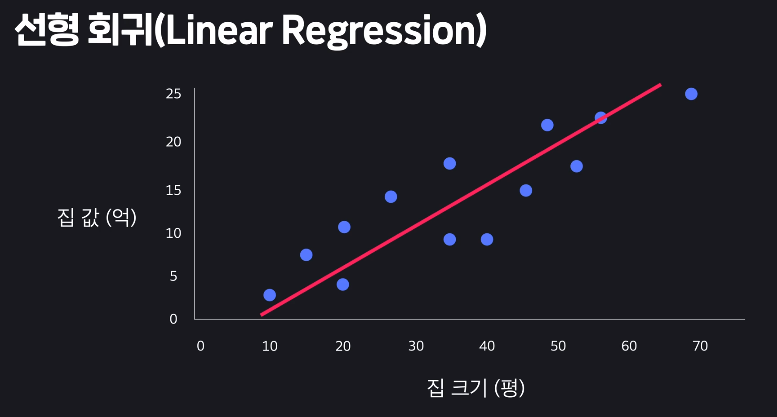
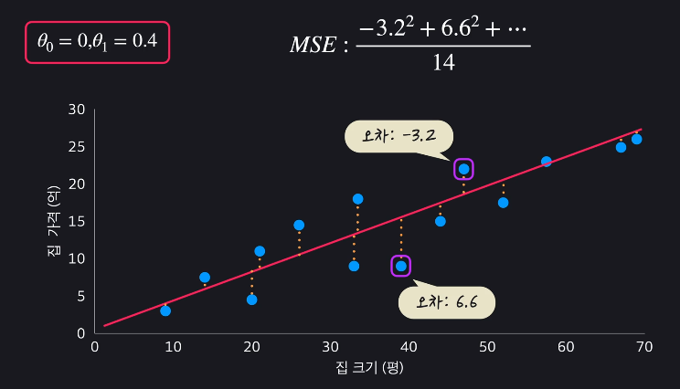

## 선형회귀
- 집가격 예측 모델   

- 가장 데이터셋을 잘 표현하는 직선을 찾는 것

## 선형회귀 용어
- 지도학습이라고 할 수 있음 (회귀)
- 목표변수 : target variable/output variable
- 입력변수 : input variable/feature
- 학습데이터의 갯수 : M
    - 1번 인풋데이터의 값 = 1번 아웃풋 데이터
    - 

## 가설함수
- 선형함수로 표현
- 
- 변수가 많아지면 x1, x2, ...
- 
- 가장 적절한 theta 를 찾아낸다.

## 평균제곱오차(MSE)
- 가설함수 평가방법 중 하나
- 
- 차이의 제곱을 평균낸다

## 평균제곱오차 일반화
- 