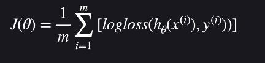

# 로지스틱 회귀(Logistic Regression)

- 분류문제
- 선형회귀로도 로지스틱 회귀(분류)를 할 수 있으나 이상점(특이한 데이터)로인해 회귀선의 기울기값이 크게 조정될 수 있어서 잘 쓰이지 않음
- 

## 로지스틱 회귀

- 선형회귀 : 예외적인 데이터에 민감하다 --> 로지스틱 회귀의 시그모이드 함수 사용
  
### 시그모이드 함수

- 
- 
  - 항상 0~1사이의 값

## 로지스틱 회귀 가설함수

- 
- 
  - 나온값은 항상 0~1사이의 값 : 1에가까울 수록 통과(분류) 될 확률이 높음
- 
- 변수가 여러개 일때는 시각화 하기는 어렵지만, 똑같이 생각하면 됨
- 

## 로지스틱 회귀 손실함수

- 로그 손실
  - 
    - 손실의 정도를 로그함수(log-loss)로 결정!
  - 
    - 한 줄로 표현
- 손실 함수
  - 
  - 

## 로지스틱 회귀 경사하강법

- 편미분 해서 손실함수를 통해 경사하강법 실시
  - 선형회귀와 같은 결과가 나옴(과정 생략)
- 
  - j : 1~n
- 

## 분류가 3개 이상일 때

- 
- 가장 높은 값으로 예측

## 정규 방정식

- 선형 회귀처럼 단순 행렬 연산만으로 최소지점 찾을 수 없음
  - 로지스틱회귀의 손실함수는 convex형태임
  - 하지만, 편미분한 형태는 convex형태가 아님

## sklearn

- sklearn.ipynb참고