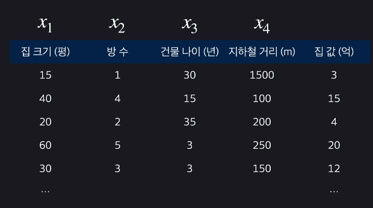
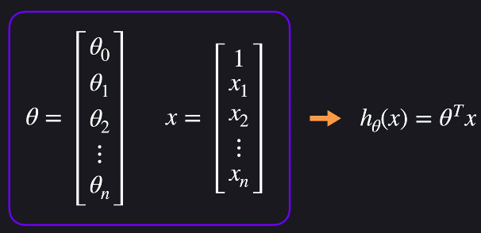
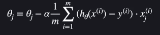
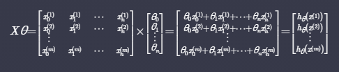
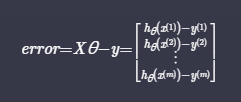
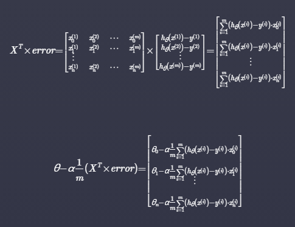
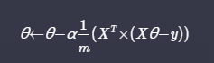
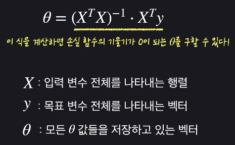
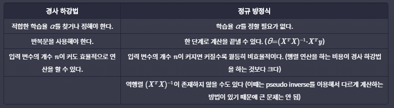

# 다중 선형 회귀

- 입력 변수가 두개이상인 상황
- 시각화는 힘들지만 기본 개념은 같음

## 다중 선형회귀 표현법

- 
- 입력 변수 여러개 : feature 여러개
- 목표변수는 여전히 1개
- i번째 데이터 j번째 속성 : 

## 다중 선형 회귀 가설 함수

- 
- 각 theta는 feature
- theta 를 조율하여 최적의 값 구하기
- 
- 가설함수를 간단하게 표현한 것

## 다중 선형 회귀 경사 하강법

- 손실함수
  
 > 

- 손실함수의 값이 작으면 --> 데이터에 잘 맞다
- 경사하강법(j : 1부터 n까지)
  - 

## 다중 선형 회귀 쉽게 표현하기

- 모든 데이터 예측값
  - 
  - x0 = 1
- 예측 오차
  - 
- 경사하강법
  - 
    - 유도과정
  - 

## 정규방정식

- 손실함수

> 

- 
  - 손실함수를 미분해서 0되는 지점 찾기
- 

### 경사하강법 vs 정규 방정식 비교

- 

## Convex함수

- 아래로 볼록한 함수
  - 경사하강법을 사요했을 때 극소점이 하나만 나오는 형태
  - Convex 형태가 아니라면, 구한 극소점이 최소점이 아닐 수 있음

## Scikit-learn

- sklearn.ipynb 참고