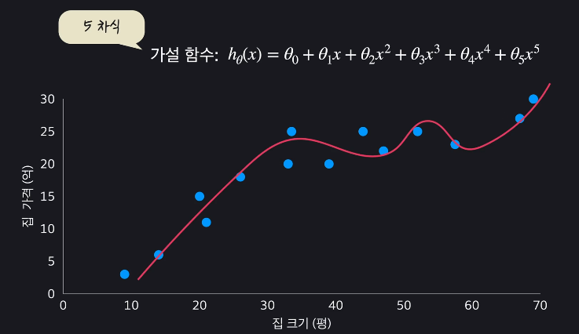

# 다항회귀(Polynomial Regression)

- 곡선형태의 회귀
- 

## 단일속성 다항회귀

- 2차함수 형태
- 
- 가장 잘 맞는 theta.. 를 찾는 것
  - 입력변수 3개인 다항회귀와 유사함

## 다중 다항 회귀

- 입력변수가 여러개인 다중 선형회귀처럼 생각하면 됨
- 속성들을 서로 곱해서 차항을 높여주면, 그러니까 선형 회귀 문제를 다항 회귀 문제로 만들어주면 속성들 사이에 있을 수 있는 복잡한 관계들을 프로그램에 학습시킬 수 있음
  - ex) 집값예측
    - 넓이 = 높이 * 너비
