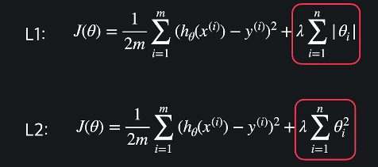

# Regularization

## 편향과 분산

- 모델이 너무 단순해서 곡선 관계를 학습할 수 없는 경우 : 편향이 높다(Biased)
- 모델이 데이터 사이의 관계를 완벽하게 이해했다 : 편향이 낮다
  - 편향이 낮은 모델이 높은 모델보다 항상 좋은 것이 아님
- 분산 : 데이터 셋 별로 모델이 얼마나 일관된 성능을 보여주는지 

## 편향과 분산 트레이드오프

- 과소적합
  - 모델이 단순하면 편향이 높고 분산이 낮다. 어떤 데이터에 대해서도 일관된 성능
- 과적합
  - 편향이 매우 낮은 경우 overfit(training데이터에 대한 학습률은 높고, 테스트 데이터 성능은 낮음) 될 수 있음
- 둘 사이의 적당한 밸런스를 찾아야 함

## sklearn 과적합 문제

- sklearn.ipynb 참고

## 정규화

- 과적합 방지
- 가설함수의 theta값들이 너무 커지는 것을 방지해서 과적합을 예방하는 방법

## L1, L2 정규화

- Theta값들이 너무 커지는 것을 방지하기 위해 절댓값들을 더해줘서 성능을 측정한다
  - 손실함수의 값이 작을 수록 성능이 좋다고 판단
- L1 : Lasso 모델
- L2 : Ridge 모델
- 

## L1,L2 sklearn

- sklearn.ipynb 참고

## L1,L2 정규화 일반화

- 해당 모델에  또는  더해주면 됨

- LogisticRegression 은 penalty라는 옵션으로 정규화 가능
```python
LogisticRegression(penalty='none')  # 정규화 사용 안함
LogisticRegression(penalty='l1')  # L1 정규화 사용
LogisticRegression(penalty='l2')  # L2 정규화 사용
LogisticRegression()  # 위와 똑같음: L2 정규화 사용
```

## 차이점

- L1 손실 함수를 최소화하는 \theta는 여러 \theta_i 가 0일 확률이 높음
- L2 손실 함수를 최소화하는 \theta는 모든 \theta_i 가 0이 아닐 확률이 높음
