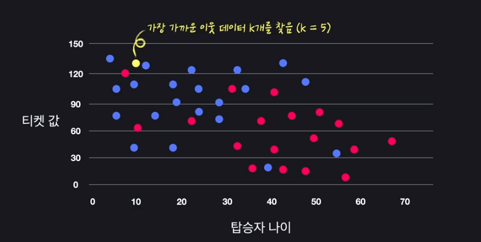

## 머신러닝이란?
- 기계학습, 학습을 할수록 정확성이 높아짐
- 기계가 학습한다는 건, 프로그램이 특정 작업(T)를 하는데 있어서 경험(E)를 통해 작업의 성능(P)를 향상시키는 것 by 톰 미첼

## 머신러닝이 핫해진 이유
- 데이터가 많이 쌓임, 모든 생활이 데이터로 기록됨
    - 데이터를 모으는 방법도 쉬워짐
- 컴퓨터의 성능이 좋아짐
- 활용성이 증명되었음

## 인공지능/빅데이터/머신러닝
- 빅데이터 : 많은 양의 데이터를 효율적으로 보관/처리 또는 분석
- 인공지능 : 프로그램이 인간처럼 생각/행동하게 하는 학문
- 딥러닝 : 머신러닝 학습 기법 중 하나

## 학습의 유형
- 지도 학습(Supervised Learning) : '답'이 있고 답을 맞추는 것이 학습의 목적
    1. 분류(Classfication)
        - 정해진 옵션 중에서 맞추기
    2. 회귀(Regression) 
        - 아파트 가격 예측(무수히 많은 값 중 맞추기)
    - 답을 알려줘야 함
- 비지도 학습(Unsupervised learning) : '답'이없고 답을 맞추는것

## K-NN 알고리즘(k-Nearest Neighbors Algorithm)

- 가까운 점 k개를 찾아서 예측함

## 머신러닝의 수학
- 컴퓨터과학 + 수학
- 상황에 맞는 알고리즘 선택하고 최적화를 위해서 수학을 익혀야함
- 선형대수, 미분, 통계, 확률
1. 선형대수학
    - 행렬 : 많은 데이터를 묶어서 효율적으로 계산
2. 미적분학
    - 최적화할 때 사용
3. 통계
    - 데이터의 특징 파악
4. 확률
    - 예측